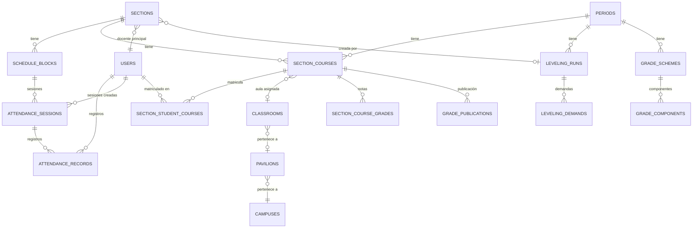

# 📊 Modelo de Datos - UAI Nivelación

> Documentación detallada de todas las entidades, tablas intermedias y relaciones del sistema.

---

## 1. Entidades con ORM (TypeORM)

### 1.1 `periods` — Periodos Académicos

```
┌──────────────────────────────────────────────────┐
│                    periods                        │
├──────────────┬───────────────┬────────────────────┤
│ Campo        │ Tipo          │ Descripción        │
├──────────────┼───────────────┼────────────────────┤
│ id           │ UUID (PK)     │ Identificador      │
│ code         │ VARCHAR(40)   │ Único. Ej: "2026-I"│
│ name         │ VARCHAR(120)  │ Nombre del periodo │
│ kind         │ VARCHAR(20)   │ "NIVELACION"       │
│ status       │ VARCHAR(20)   │ "ACTIVE"|"INACTIVE"│
│ startsAt     │ DATE (null)   │ Fecha de inicio    │
│ endsAt       │ DATE (null)   │ Fecha de fin       │
│ createdAt    │ DATETIME      │ Auto-generado      │
│ updatedAt    │ DATETIME      │ Auto-generado      │
└──────────────┴───────────────┴────────────────────┘
```

**Reglas de negocio:**
- Solo puede haber **un periodo activo** a la vez.
- El periodo activo es el contexto para todas las operaciones del admin.
- `kind`: por defecto `NIVELACION`, preparado para `REGULAR`.

---

### 1.2 `users` — Usuarios del Sistema

```
┌──────────────────────────────────────────────────────────────┐
│                         users                                 │
├──────────────────┬───────────────┬─────────────────────────────┤
│ Campo            │ Tipo          │ Descripción                 │
├──────────────────┼───────────────┼─────────────────────────────┤
│ id               │ UUID (PK)     │ Identificador               │
│ codigoAlumno     │ VARCHAR(50)   │ Nullable. Ej: "U20250123"  │
│ dni              │ VARCHAR(20)   │ Único. DNI o "administrador"│
│ fullName         │ VARCHAR(200)  │ Nombre completo             │
│ names            │ VARCHAR(160)  │ Nullable. Solo nombres      │
│ paternalLastName │ VARCHAR(120)  │ Nullable. Apellido paterno  │
│ maternalLastName │ VARCHAR(120)  │ Nullable. Apellido materno  │
│ email            │ VARCHAR(200)  │ Nullable. Correo            │
│ sex              │ VARCHAR(20)   │ Nullable. M/F               │
│ careerName       │ VARCHAR(200)  │ Nullable. Carrera           │
│ examDate         │ VARCHAR(255)  │ Nullable. Fecha de examen   │
│ role             │ ENUM          │ ALUMNO|ADMIN|DOCENTE        │
│ passwordHash     │ VARCHAR(255)  │ Nullable. Solo para admin   │
│ createdAt        │ DATETIME      │ Auto-generado               │
│ updatedAt        │ DATETIME      │ Auto-generado               │
└──────────────────┴───────────────┴─────────────────────────────┘
```

**Relaciones:**
- `1:N` → `attendance_sessions` (sesiones creadas)
- `1:N` → `attendance_records` (registros de asistencia)

**Reglas:**
- Alumnos: password = su propio DNI (comparación directa).
- Docentes: password = su propio DNI (comparación directa).
- Admin: password hasheado con bcrypt (10 rounds).

---

### 1.3 `sections` — Secciones Académicas

```
┌──────────────────────────────────────────────────────────────┐
│                        sections                               │
├──────────────────┬───────────────┬─────────────────────────────┤
│ Campo            │ Tipo          │ Descripción                 │
├──────────────────┼───────────────┼─────────────────────────────┤
│ id               │ UUID (PK)     │ Identificador               │
│ name             │ VARCHAR(120)  │ Nombre. Ej: "Sección A-PS"  │
│ code             │ VARCHAR(30)   │ Único, nullable. "A-PS-IC"  │
│ akademicSectionId│ VARCHAR(60)   │ Nullable. ID en Akademic    │
│ facultyGroup     │ VARCHAR(20)   │ Nullable. "FICA", "SALUD"   │
│ facultyName      │ VARCHAR(160)  │ Nullable. Nombre completo   │
│ campusName       │ VARCHAR(120)  │ Nullable. "SEDE ICA"        │
│ modality         │ VARCHAR(20)   │ Nullable. "PRESENCIAL"|...  │
│ teacherId        │ FK → users    │ Nullable. Docente principal  │
│ initialCapacity  │ INT UNSIGNED  │ Default: 45                 │
│ maxExtraCapacity │ INT UNSIGNED  │ Default: 0 (0=ilimitado)    │
│ isAutoLeveling   │ BOOLEAN       │ Default: false              │
│ levelingRunId    │ CHAR(36)      │ Nullable. FK a leveling_runs│
│ createdAt        │ DATETIME      │ Auto-generado               │
│ updatedAt        │ DATETIME      │ Auto-generado               │
└──────────────────┴───────────────┴─────────────────────────────┘
```

**Relaciones:**
- `N:1` → `users` (docente principal)
- `1:N` → `schedule_blocks` (bloques horarios)

**Convención de códigos:**
```
Formato: [LETRA]-[MODALIDAD]-[SEDE]
Ejemplo: A-PS-IC → Sección A, Presencial, Sede Ica
         B-VI-CH → Sección B, Virtual, Sede Chincha
```

---

### 1.4 `teachers` — Catálogo de Docentes

```
┌──────────────────────────────────────────────────┐
│                    teachers                       │
├──────────────┬───────────────┬────────────────────┤
│ Campo        │ Tipo          │ Descripción        │
├──────────────┼───────────────┼────────────────────┤
│ id           │ UUID (PK)     │ Identificador      │
│ dni          │ VARCHAR(20)   │ Único. DNI         │
│ fullName     │ VARCHAR(180)  │ Nombre completo    │
│ createdAt    │ DATETIME      │ Auto-generado      │
│ updatedAt    │ DATETIME      │ Auto-generado      │
└──────────────┴───────────────┴────────────────────┘
```

> Nota: Los docentes también tienen un registro en `users` con `role=DOCENTE`. La tabla `teachers` es un catálogo complementario.

---

### 1.5 `classrooms` — Aulas Físicas

```
┌──────────────────────────────────────────────────────────────┐
│                       classrooms                              │
├──────────────┬──────────────────────┬─────────────────────────┤
│ Campo        │ Tipo                 │ Descripción             │
├──────────────┼──────────────────────┼─────────────────────────┤
│ id           │ UUID (PK)            │ Identificador           │
│ campusId     │ CHAR(36) nullable    │ FK → campuses           │
│ pavilionId   │ CHAR(36) nullable    │ FK → pavilions          │
│ campusName   │ VARCHAR(120)         │ Nombre de sede          │
│ code         │ VARCHAR(60)          │ Código de aula          │
│ name         │ VARCHAR(160)         │ Nombre descriptivo      │
│ capacity     │ INT UNSIGNED         │ Aforo máximo            │
│ levelName    │ VARCHAR(80) nullable │ Piso/nivel              │
│ type         │ ENUM                 │ AULA|LABORATORIO|AUDIT. │
│ status       │ ENUM                 │ ACTIVA|INACTIVA         │
│ notes        │ VARCHAR(255) null    │ Observaciones           │
│ createdAt    │ DATETIME             │ Auto-generado           │
│ updatedAt    │ DATETIME             │ Auto-generado           │
└──────────────┴──────────────────────┴─────────────────────────┘
```

**Reglas:**
- Solo aulas con `status=ACTIVA` pueden asignarse a secciones-curso.
- El `capacity` determina el aforo real para matrícula presencial.

---

### 1.6 `pavilions` — Pabellones

```
┌──────────────────────────────────────────────────┐
│                    pavilions                      │
├──────────────┬───────────────┬────────────────────┤
│ Campo        │ Tipo          │ Descripción        │
├──────────────┼───────────────┼────────────────────┤
│ id           │ UUID (PK)     │ Identificador      │
│ campusId     │ CHAR(36)      │ FK → campuses      │
│ code         │ VARCHAR(60)   │ Código             │
│ name         │ VARCHAR(120)  │ Nombre             │
│ status       │ ENUM          │ ACTIVO|INACTIVO    │
│ createdAt    │ DATETIME      │ Auto-generado      │
│ updatedAt    │ DATETIME      │ Auto-generado      │
└──────────────┴───────────────┴────────────────────┘
```

---

### 1.7 `schedule_blocks` — Bloques Horarios

```
┌──────────────────────────────────────────────────────────────┐
│                     schedule_blocks                           │
├──────────────────┬───────────────┬─────────────────────────────┤
│ Campo            │ Tipo          │ Descripción                 │
├──────────────────┼───────────────┼─────────────────────────────┤
│ id               │ UUID (PK)     │ Identificador               │
│ sectionId        │ FK → sections │ Sección propietaria         │
│ sectionCourseId  │ CHAR(36) null │ FK → section_courses        │
│ courseName       │ VARCHAR(200)  │ Nombre del curso            │
│ dayOfWeek        │ TINYINT       │ 1=Lunes ... 7=Domingo      │
│ startTime        │ CHAR(5)       │ HH:mm (ej: "08:00")        │
│ endTime          │ CHAR(5)       │ HH:mm (ej: "10:00")        │
│ startDate        │ DATE nullable │ Fecha inicio de vigencia    │
│ endDate          │ DATE nullable │ Fecha fin de vigencia       │
│ zoomUrl          │ VARCHAR(500)  │ Nullable. URL de Zoom       │
│ location         │ VARCHAR(200)  │ Nullable. Ubicación física  │
│ referenceModality│ VARCHAR(20)   │ Nullable. Modalidad ref.    │
│ referenceClassroom│VARCHAR(150)  │ Nullable. Aula de referencia│
│ createdAt        │ DATETIME      │ Auto-generado               │
└──────────────────┴───────────────┴─────────────────────────────┘
```

**Relaciones:**
- `N:1` → `sections`
- `1:N` → `attendance_sessions`

---

### 1.8 `attendance_sessions` — Sesiones de Asistencia

```
┌──────────────────────────────────────────────────────────────┐
│                   attendance_sessions                         │
├──────────────────┬───────────────────┬─────────────────────────┤
│ Campo            │ Tipo              │ Descripción             │
├──────────────────┼───────────────────┼─────────────────────────┤
│ id               │ UUID (PK)         │ Identificador           │
│ scheduleBlockId  │ FK → schedule_blk │ Bloque horario          │
│ sessionDate      │ DATE              │ Fecha de la sesión      │
│ createdById      │ FK → users        │ Docente que creó        │
│ createdAt        │ DATETIME          │ Auto-generado           │
└──────────────────┴───────────────────┴─────────────────────────┘
```

**Constraint:** UNIQUE(scheduleBlockId, sessionDate)

---

### 1.9 `attendance_records` — Registros de Asistencia

```
┌──────────────────────────────────────────────────────────────┐
│                   attendance_records                          │
├──────────────────────┬───────────────┬────────────────────────┤
│ Campo                │ Tipo          │ Descripción            │
├──────────────────────┼───────────────┼────────────────────────┤
│ id                   │ UUID (PK)     │ Identificador          │
│ attendanceSessionId  │ FK → sessions │ Sesión                 │
│ studentId            │ FK → users    │ Alumno                 │
│ status               │ ENUM          │ ASISTIO|FALTO          │
│ notes                │ TEXT nullable  │ Observaciones          │
│ createdAt            │ DATETIME      │ Auto-generado          │
│ updatedAt            │ DATETIME      │ Auto-generado          │
└──────────────────────┴───────────────┴────────────────────────┘
```

**Constraint:** UNIQUE(attendanceSessionId, studentId)

---

### 1.10 `leveling_runs` — Corridas de Nivelación

```
┌──────────────────────────────────────────────────────────────┐
│                     leveling_runs                             │
├──────────────────┬───────────────┬─────────────────────────────┤
│ Campo            │ Tipo          │ Descripción                 │
├──────────────────┼───────────────┼─────────────────────────────┤
│ id               │ UUID (PK)     │ Identificador               │
│ periodId         │ CHAR(36)      │ FK → periods                │
│ status           │ VARCHAR(20)   │ STRUCTURED|READY|MATRIC.|ARCH│
│ configJson       │ JSON nullable │ Configuración usada         │
│ reportsJson      │ JSON nullable │ Reportes generados          │
│ sourceFileHash   │ VARCHAR(128)  │ SHA-256 del archivo fuente  │
│ createdBy        │ CHAR(36) null │ FK → users (quien lo creó)  │
│ createdAt        │ DATETIME      │ Auto-generado               │
│ updatedAt        │ DATETIME      │ Auto-generado               │
└──────────────────┴───────────────┴─────────────────────────────┘
```

**Estados del ciclo de vida:**

```
STRUCTURED → La estructura (secciones/cursos) fue creada
READY      → Horarios y docentes están completos
MATRICULATED → La matrícula fue ejecutada
ARCHIVED   → Corrida archivada (no editable)
```

---

### 1.11 `leveling_run_student_course_demands` — Demandas

```
┌──────────────────────────────────────────────────────────────┐
│           leveling_run_student_course_demands                 │
├──────────────────┬───────────────┬─────────────────────────────┤
│ Campo            │ Tipo          │ Descripción                 │
├──────────────────┼───────────────┼─────────────────────────────┤
│ id               │ UUID (PK)     │ Identificador               │
│ runId            │ CHAR(36)      │ FK → leveling_runs          │
│ studentId        │ CHAR(36)      │ FK → users                  │
│ courseId          │ CHAR(36)      │ FK → courses                │
│ facultyGroup     │ VARCHAR(20)   │ Nullable                    │
│ campusName       │ VARCHAR(120)  │ Nullable                    │
│ sourceModality   │ VARCHAR(20)   │ PRESENCIAL|VIRTUAL|SIN DATO │
│ examDate         │ VARCHAR(32)   │ Nullable. Fecha de examen   │
│ required         │ BOOLEAN       │ Default: true               │
│ createdAt        │ DATETIME      │ Auto-generado               │
│ updatedAt        │ DATETIME      │ Auto-generado               │
└──────────────────┴───────────────┴─────────────────────────────┘
```

---

### 1.12 `section_course_teachers` — Docente por Sección-Curso

```
┌──────────────────────────────────────────────────────────────┐
│                section_course_teachers                         │
├──────────────────┬───────────────┬─────────────────────────────┤
│ Campo            │ Tipo          │ Descripción                 │
├──────────────────┼───────────────┼─────────────────────────────┤
│ id               │ UUID (PK)     │ Identificador               │
│ sectionId        │ FK → sections │ Sección                     │
│ sectionCourseId  │ CHAR(36)      │ Unique. → section_courses   │
│ courseId          │ CHAR(36)      │ FK → courses                │
│ teacherId        │ FK → users    │ Nullable. Docente asignado  │
│ createdAt        │ DATETIME      │ Auto-generado               │
│ updatedAt        │ DATETIME      │ Auto-generado               │
└──────────────────┴───────────────┴─────────────────────────────┘
```

---

## 2. Tablas sin Entity ORM (SQL directo)

### 2.1 `section_courses`

Relación entre sección, curso y periodo. Incluye asignación de aula y capacidad individual.

Campos principales: `id`, `sectionId`, `courseId`, `periodId`, `idakademic`, `classroomId`, `initialCapacity`, `maxExtraCapacity`.

### 2.2 `section_student_courses`

Matrícula individual: alumno asignado a una sección-curso específica.

Campos: `id`, `sectionCourseId`, `sectionId`, `courseId`, `studentId`.

### 2.3 `courses`

Catálogo de cursos: `id`, `name`, `code`, `kind`.

### 2.4 `careers`

Catálogo de carreras con mapeo a facultad: `id`, `name`, `facultyGroup`, `facultyName`.

### 2.5 `campuses`

Catálogo de sedes: `id`, `name`, `code`.

### 2.6 `grade_schemes`

Esquema de calificación por periodo: `id`, `periodId`, `status` (DRAFT|LOCKED).

### 2.7 `grade_scheme_components`

Componentes de nota: `id`, `schemeId`, `code`, `name`, `weight`, `orderIndex`, `minScore`, `maxScore`, `isActive`.

### 2.8 `section_course_grades`

Notas individuales: `id`, `sectionCourseId`, `studentId`, `componentId`, `score`, `updatedBy`.

### 2.9 `section_course_grade_publications`

Estado de publicación: `id`, `sectionCourseId`, `periodId`, `isPublished`, `publishedAt`, `publishedBy`.

---

## 3. Diagrama Mermaid de Relaciones


